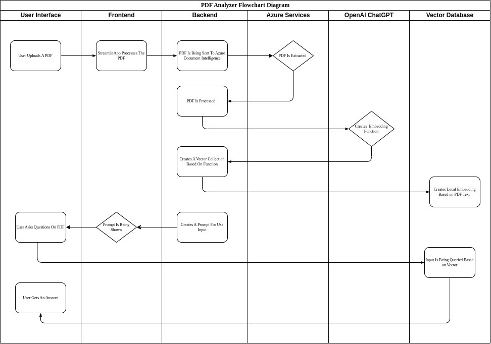
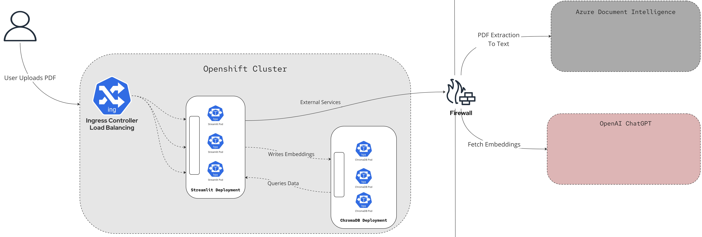
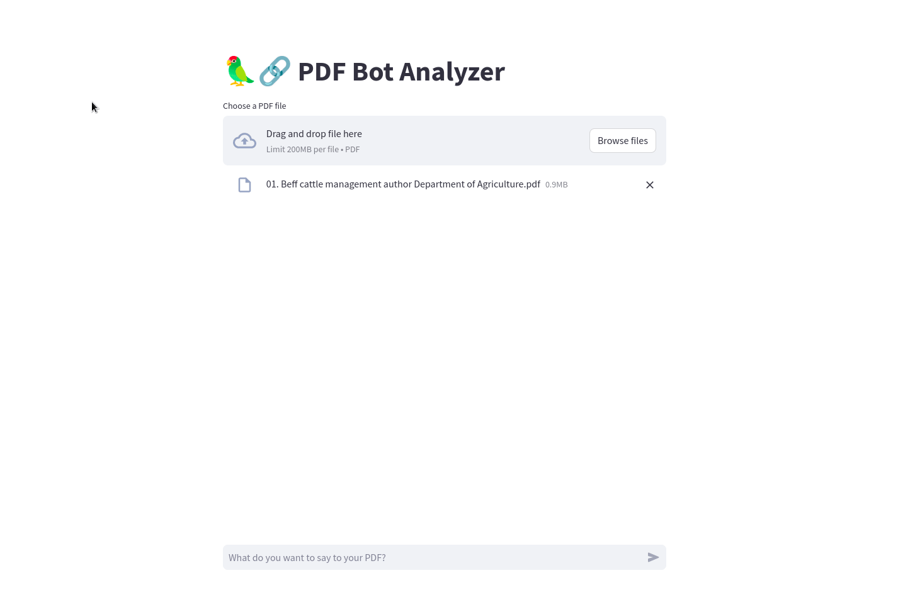

# Streamlit PDF Bot Analyzer

This repository contains all the relevant information regarding the creation of a ChatBot based on ChatGPT and Azure Document Intellignece. This bot will act as a virtual assistant for end users, and will be accessible 24/7 for all their needs.

With this bot, users will be able to upload PDF files to a frontend interface based on `streamlit` and ask questions related to the uploaded PDF. 

## Flowchart Diagram 

In order to emphasize better what's the data flow when interacting with the bot, please take a look at the following diagram: 



In this diagram, a user interacts with the `streamlit` frontend interface in order to upload a PDF file that can be summarized. 

After uploading the document, the PDF is being sent for `Azure Document Intelligence` service for text extraction. Once the PDF is transformed into text, `OpenAI GPT` is being used in order to create an embeeding function that will be used to store local embeddings based on the PDF text to `ChromaDB`. 

Once the local embeddings are updated in `ChromaDB`, the user gets a prompt and can ask questions based on the PDF text. 

## Architectual Diagram 

In order to better understand what are the components that are participating in this architecture, please take at look at the following diagram: 



## Deploying On Openshift 

In order to deploy this demo on an Openshift cluster, make sure to first prepare the following prerequisites: 

### Prerequisites 
* A running Openshift Cluster 
* Azure Document Intelligence and OpenAI ChaGPT API Keys 

### Preparing For Installation 

Before you start, create a new Openshift project that will be used for deploying our application: 

```bash 
$ oc new-project streamlit-pdf-bot
``` 

After that, as `ChromaDB` is using privileged escalation containers, we'll have to change the `SCC` to `anyuid` just for the sake of this PoC. 

*Note!*  It's important to say - this is *not* recommended in production deployments as privileged containers are considered as a security breach. In a real production environment, you'll have to pick and choose the proper image, or create a suitable service account baed on the needed permissions.

Give escalated permissions to the `default` service account, in order for `ChromaDB` to be installed successfully: 

```bash   
$ oc adm policy add-scc-to-user anyuid -z default
``` 

### Installing Your Bot Application 

In order for `streamlit` to interact with both `Azure Document Intelligence` and `OpenAI ChatGPT` successfuly, you'll have to change the deployment's environment variables. Make sure to change the following values in the `openshift/04-streamlit-deployment.yaml` file: 

```bash
$ AZURE_API_KEY
$ OPENAI_KEY
```
After you have that ready, make sure to apply all the needed manifests for the streamlit application to start functioning: 

```bash 
$ oc apply -f openshift/
``` 

Make sure that your bot application is running within your namespace: 

```bash
$ oc get pods 

NAME                                    READY   STATUS    RESTARTS   AGE
chromadb-deployment-5b9fc4fb57-vpr4h    1/1     Running   0          32h
streamlit-deployment-85f95b884d-9f29k   1/1     Running   0          32h
streamlit-deployment-85f95b884d-vzwjg   1/1     Running   0          32h
```

Now, grab that Openshift route in order to access your bot application from the outside world: 

```bash
$ oc get route 
NAME            HOST/PORT                                                                PATH   SERVICES            PORT   TERMINATION   WILDCARD
streamlit-app   streamlit-app-streamlit-app.apps.cluster-74plr.sandbox1314.opentlc.com          streamlit-service   8501   edge          None

```
### Acessing  Your Bot Application 

Grab the route URL from the previous stage, and paste it in your browser, if your deployment is successfull, you should be able to see the following screen: 




## Building Your Bot Application 

In order to build the Streamlit container, we'll have to first switch the `src` directory: 

```bash
$ cd src/
```
Now, you can build the image using the `Containerfile` you have in the `src` directory: 

```bash
$ podman build -t <image_name> .
```


